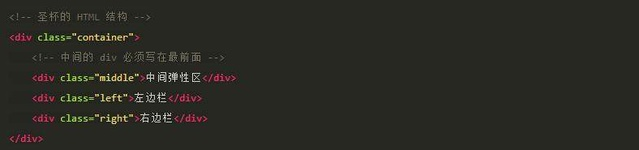

# CSS 经典布局  
 css布局的涉及的问题一般有:水平居中,垂直居中,水平垂直居中,两列自适应布局,三列自适应布局,清除浮动.经典的布局解决方案一般有:圣杯布局,双飞翼布局.  
 
 ## 圣杯布局  
- 圣杯：父盒子包含三个子盒子（左，中，右）.
- 中间盒子的宽度设置为 width: 100%; 独占一行.
- 使用负边距(均是 margin-left)把左右两边的盒子都拉上去和中间盒子同一行. 
- `.left{margin-left:-100%}`把左边的盒子拉上去.
- `.right {margin-left：-右边盒子宽度px;}`把右边的盒子拉上去. 
- 父盒子设置左右的 padding 来为左右盒子留位置.
- 对左右盒子使用相对布局来占据 padding 的空白，避免中间盒子的内容被左右盒子覆盖

  
  

[参考链接](https://www.jianshu.com/p/f9bcddb0e8b4)